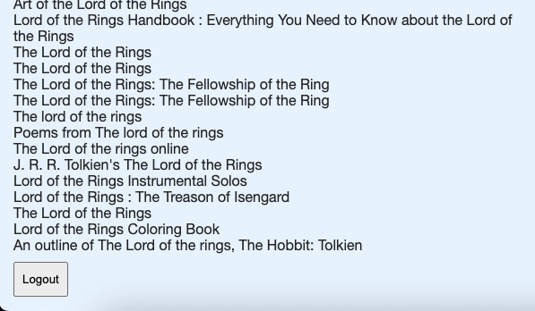

# Simple React example - fetching Books off of Open Library

### What is this about?
A simple React example app, built during Achievement 3 in [Career Foundry's Full-Stack Web Development Program](https://careerfoundry.com/en/courses/become-a-web-developer/). <br>
The app fetches data from the [Open Libary API](https://openlibrary.org/developers/api) and displays it. <br>
The app has a combined log-in / sign-up view. Why combined? <br>
Only the log-in part is working (see credentials below). <br>
The sign-up part is not working, as Open Library does NOT have a sign-up endpoint - the sign-up part is only for practicing purposes. <br>

### Requirements
- once logged in, the user should see a list of "Lord of the Ring" book "cards" (cards are not styled, only consists of the book title)
- clicking on one "card" (book title) gets user to a detailed book view that displays the book cover, the book title, the book author
- the detailed book view has a log-out button
- [for Screenshots jump here](#Screenshots)

### Sources
- [Open Libary API](https://openlibrary.org/developers/api)
- required Open Library response format with example [Lord of the Rings](https://openlibrary.org/dev/docs/api/search)
- [JSON Lord of the Rings](https://openlibrary.org/search.json?q=the+lord+of+the+rings)
- credentials for login:
```
username: 167OLdP5BUfLZGxP
password: K39eKYhPMV9DDWhJ
```

### Languages, Libraries, Frameworks, Tools
- HTML
- SCSS
- JavaScript
- JSX
- Parcel.js
- React
- React DOM
- prop-types package

### Screenshots

 <br>
 <br>
 <br>
 <br>

### How to run this?
- clone the repo
- `cd` into project
- `npm install`
- run parcel to build the project with `npm run start`